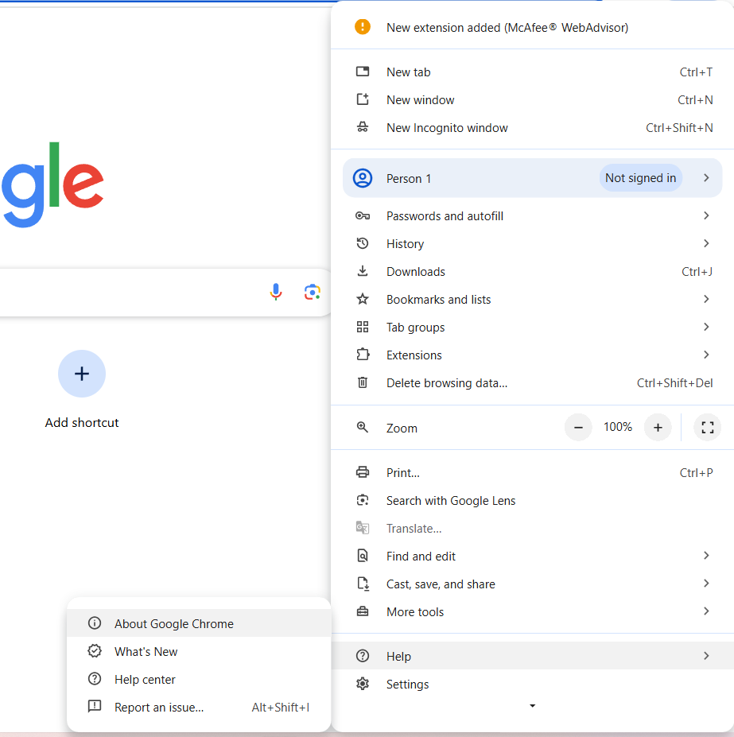
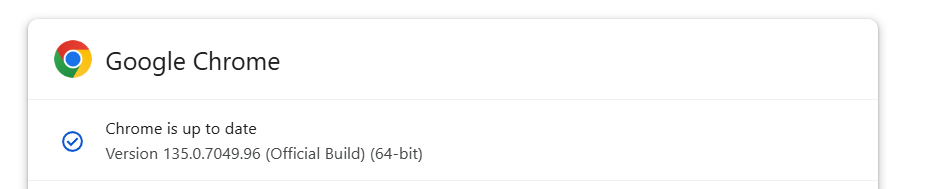

# AutoMeet

## Overview

Get your google meet transcript with this AI Google Meet Transcriptor. Joins the meet and provides you the whole transcript of the meet.

## Objectives
- **Meeting Documentation:** Record audio, transcribe meeting content with speaker details and generate a summary.
- **Joining Automation:** Joins through your Google Meet calender, removing the need to constantly change the meet passcode.

## Implementation and Tech Stack

1. **Google Calendar API** to fetch details of upcoming meetings
2. **Selenium** to automate all interactions will Google Meet
3. **BeautifulSoup** to scrape live captions and chat box messages
5. **GTTS module** to generate speech from text
6. **ConfigParserCrypt** to store encrypted user credentials in a config file
7. **PyAudio** to record meeting audio
8. **Popen** and **Signal** to start recording audio as a subprocess and stop recording
9. **AssemblyAI API** to generate a meeting transcript and a summary

## Installation and Usage

1. Clone/download this repository.
3. Create a virtual environment and activate it.

    > `python3 -m venv env`
    
    > `source env/bin/activate`

5. Install requirements.

    > `pip install -r requirements.txt`

6. Turn off Two-Factor Authentication for the account you want to join the meeting with. Enter your email ID and password in `set_up_config.py`.

8. Sign up at  https://www.assemblyai.com/dashboard/signup and get your API key. Paste it in `set_up_config.py`.

9. Run `set_up_config.py`. Now all your credentials will be saved in an encrypted config file. Paste the AES key that is printed in `get_credentials.py`. 

10. Go to https://developers.google.com/calendar/api/quickstart/python and follow the given steps to create a Google Cloud Project and enable Google Calendar API. A JSON file will be downloaded. Save it as `credentials.json` and move it to the current working directory.

    You will be required to sign in to your account when running the program for the first time to complete authentication.

11. Download a ChromeDriver according to your Chrome version from https://googlechromelabs.github.io/chrome-for-testing/#stable. Extract the folder and add its path in `meet_functions.py`. 

    If you don't find the required ChromeDriver version (which should be same as your Chrome Version), update your Chrome. If your Chrome update fails, first update your Windows.

    Steps to find Your Chrome Version
    
    

14. Run `main.py`. 

15. The transcript and summary of the meeting will be saved at your local.
